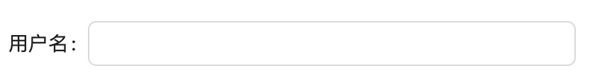
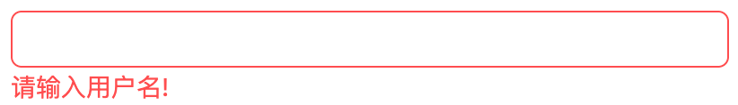
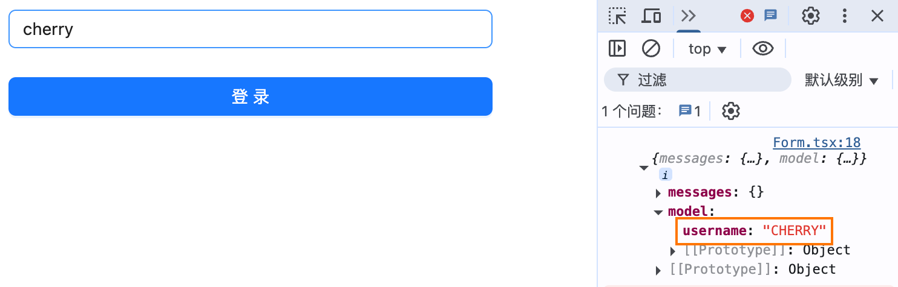

- 我会在这个几个样板代码中，尽可能体现出SignalsForm的设计理念。

## 第一个输入

## 组件
- 创建一个组件，与用户进行交互

```ts
import type { Messages } from "@signals-form/core";

export default function Input(props: {
  label: string
  placeholder: string
  value: string
  messages: Messages
  onChange: (value: string) => void
}) {
  return (
    <div>
      <label>{props.label}: </label>
      <input
        type="text"
        value={props.value}
        placeholder={props.placeholder}
        onChange={(e) => props.onChange(e.target.value)}
      />
      <span>
        {
          messages['error'].map((item) => Object.entries(item).map(([, value]) => value.message).join(",")).join(",")
        }
      </span>
    </div>
  )
}
```
## id与name

- 如果你看一下前面例子生成的HTML，你会看到已经创建了可访问的表单控件了。然而，由于我们没有指定其 name和id属性，因此他在表单模型中做使用的key，是一个独一无二的uuid，所以我们应该至少指定 id 属性，去使得控件具备在表单中更容易的表达。当 name 没有传值时，会默认为 id 。
- `name`属性为表单中记录字段输入的一个属性，例如，当id指定为 user，而name指定为username时。
- `id` 是保证当前字段的唯一性，在联动，或查找字段模型时使用，当name有重复时，id务必不要一致，除非这两个控件，是表达一个字段，且不在同一时刻出现
```ts
defineField({
  id: "user",
  name: "username"
  component: Input,
})
```
在表单中模型为
```json
{
    // 不是 user: "cherry"
    "username": "cherry"
}
```


## props
- 当你开始定制组件的相关特性时，那你需要类似于组件一样，添加Props选项。
```ts
defineField({
  id: "username",
  component: Input,
  props: {
    label: "username",
    placeholder: "Please enter your username !"
  },
})
```

## 设置初始值

- 当需要给字段设置初始值，有两个选项。
- initialValue：直接设置字段的初始值，可以是一个函数，或者异步函数。
- onDefaultValue：设置字段的默认值，是一个函数。

你可能有疑问，为啥这里会设计两个Api去处理字段的初始化的值？在进阶部分我会讲解两个选项之间的关系, 以及为啥需要这两个选项。

```ts
defineField({
  id: "username",
  component: Input,
  initialValue: "cherry",
  actions: {
    onDefaultValue(value: string){
      return value.toUpperCase()
    }
  }
});
```

## 添加验证

- 验证是表单的主要功能之一，它帮助用户知道他们提交的值是否正确。添加验证非常简单。已经为你实现了 `zod` 的校验器，当然校验器是可拔插的，你完全可以定制自己的校验器等等。
- 使用 `validators` 选项，添加对应的校验规则。
- 字段的验证是一个大的话题，在这里简单示例里面我们会使用最基本的校验器来说明，其他强大的能力在进阶部分解答。

```ts
defineField<string>({
  id: "username",
  component: Input,
  validators: z.string({message: '请输入用户名!'})
});
```


## 字段提交处理器

- 当字段维度，在提交时存在一些转化，例如子字段拍平，数据格式转化等等，当然这个一般是很少的，一般是来控制，字段是否被提交
- 当依赖其他字段时，可以看看进阶部分

```ts
defineField<string>({
  id: "username",
  component: Input,
  actions: {
    onSubmitValue(value) {
      return value.toUpperCase()
    }
  }
});
```

## 创建表单

- 表单模型：`form` 将收集所有字段输入的值，形成一个模型，通过form.model访问
- 使用 `FormControl` 渲染表单

```ts
import { zodResolver } from "@signals-form/resolvers";
import { defineForm } from "@signals-form/core";

const form = defineForm({
  id: "Login",
  defaultValidatorEngine: "zod",
  fields: [
    username,
  ],
  resolvers: {
    validator: {
      zod: zodResolver
    }
  }
});

export function App() {
  const handleSubmit = useCallback(async () => {
    const { messages, model } = await form.submit();
    if (!messages) {
      console.log("验证通过，表单数据:", model);
    }
  }, [form]);
  return (
    <div>
      <div>
        <FormControl form={form} />
      </div>
      <button onClick={handleSubmit}>
        登录
      </button>
    </div>
  );
}

render(App)
```
