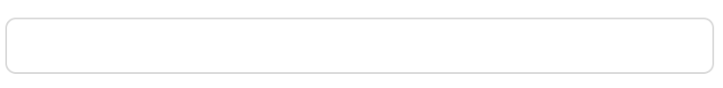
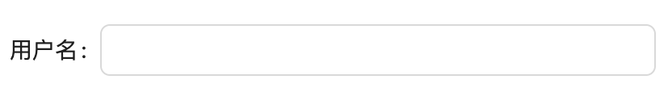
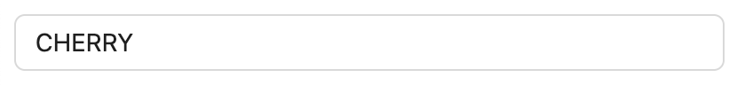
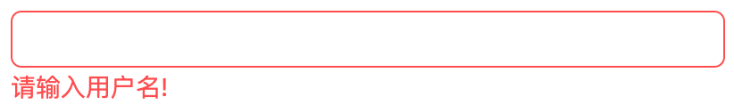
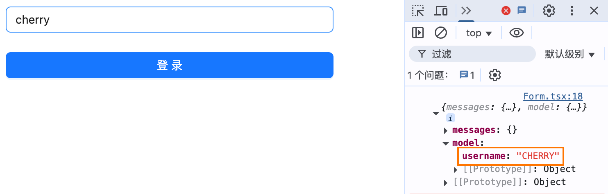

- I will demonstrate the design philosophy of SignalsForm in these sample codes as much as possible.

## First Input

## Component
- Create a component to interact with users

```ts
import type { Messages } from "@signals-form/core";

export default function Input(props: {
  label: string
  placeholder: string
  value: string
  messages: Messages
  onChange: (value: string) => void
}) {
  return (
    <div>
      <label>{props.label}: </label>
      <input
        type="text"
        value={props.value}
        placeholder={props.placeholder}
        onChange={(e) => props.onChange(e.target.value)}
      />
      <span>
        {
          messages['error'].map((item) => Object.entries(item).map(([, value]) => value.message).join(",")).join(",")
        }
      </span>
    </div>
  )
}
```

## id and name

- If you look at the HTML generated by the previous example, you'll see that accessible form controls have been created. However, since we didn't specify the name and id attributes, the key used in the form model is a unique uuid, so we should at least specify the id attribute to make the control easier to express in the form. When name is not passed, it defaults to id.
- The `name` attribute is a property for recording field input in the form. For example, when id is specified as "user" and name is specified as "username".
- `id` ensures the uniqueness of the current field, used in linkage or when looking up field models. When names are duplicated, ids must not be consistent unless these two controls express the same field and don't appear at the same time

```ts
defineField({
  id: "user",
  name: "username"
  component: Input,
})
```

In the form model:
```json
{
    // Not user: "cherry"
    "username": "cherry"
}
```



## props
- When you start customizing component-related features, you need to add Props options similar to components.

```ts
defineField({
  id: "username",
  component: Input,
  props: {
    label: "username",
    placeholder: "Please enter your username !"
  },
})
```



## Set Initial Value

- When you need to set an initial value for a field, there are two options.
- initialValue: Directly set the field's initial value, which can be a function or async function.
- onDefaultValue: Set the field's default value, which is a function.

You might wonder why there are two APIs designed here to handle field initialization values? In the advanced section, I'll explain the relationship between these two options and why both are needed.

```ts
defineField({
  id: "username",
  component: Input,
  initialValue: "cherry",
  actions: {
    onDefaultValue(value: string){
      return value.toUpperCase()
    }
  }
});
```



## Add Validation

- Validation is one of the main functions of forms, helping users know if their submitted values are correct. Adding validation is very simple. The `zod` validator has been implemented for you, and of course validators are pluggable - you can completely customize your own validators, etc.
- Use the `validators` option to add corresponding validation rules.
- Field validation is a big topic. In this simple example, we'll use the most basic validator to illustrate. Other powerful capabilities will be answered in the advanced section.

```ts
defineField<string>({
  id: "username",
  component: Input,
  validators: z.string({message: 'Please enter username!'})
});
```



## Field Submit Handler

- When there are some transformations at the field level during submission, such as flattening sub-fields, data format conversion, etc. Of course, this is generally rare, usually to control whether the field is submitted
- When depending on other fields, you can see the advanced section

```ts
defineField<string>({
  id: "username",
  component: Input,
  actions: {
    onSubmitValue(value) {
      return value.toUpperCase()
    }
  }
});
```



## Create Form

- Form model: `form` will collect all field input values to form a model, accessible through form.model
- Use `FormControl` to render the form

```ts
import { zodResolver } from "@signals-form/resolvers";
import { defineForm } from "@signals-form/core";

const form = defineForm({
  id: "Login",
  defaultValidatorEngine: "zod",
  fields: [
    username,
  ],
  resolvers: {
    validator: {
      zod: zodResolver
    }
  }
});

export function App() {
  const handleSubmit = useCallback(async () => {
    const { messages, model } = await form.submit();
    if (!messages) {
      console.log("Validation passed, form data:", model);
    }
  }, [form]);
  return (
    <div>
      <div>
        <FormControl form={form} />
      </div>
      <button onClick={handleSubmit}>
        Login
      </button>
    </div>
  );
}

render(App)
```
