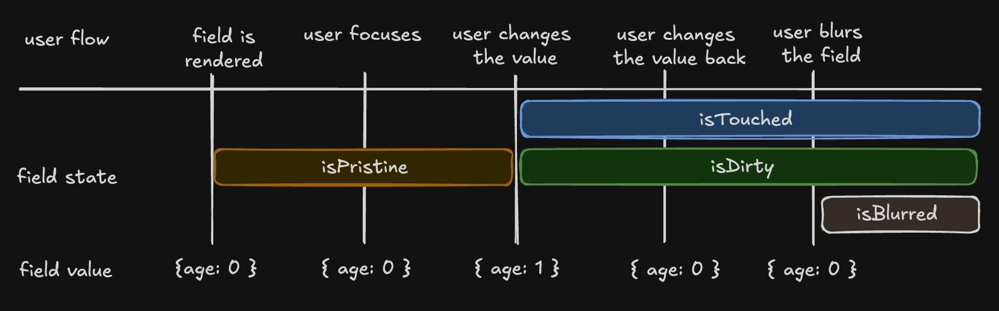

# 概览
- 字段的状态分为两种，一种为字段的值状态，另一种为字段的元信息状态。

# Handler对象
- `handler` 提供了一系列方法来操作字段状态，包括获取当前值、更新值、设置错误信息等。

## Handler状态

### 值状态
- `value`：字段的值
- `props`：字段的属性
- `messages`：字段的错误信息

### 元信息状态

#### 生命周期状态
- `isHidden`：字段是否隐藏
- `isDisabled`：字段是否禁用
- `isValidating`：字段的校验状态
- `isValid`：字段的值是否有效
- `isInitialized`：字段是否已初始化
- `isMounted`：字段是否已挂载
- `isDestroyed`：字段是否已销毁

#### 字段元状态
- `isPristine`：字段是否为初始状态
- `isTouched`：字段是否被触碰过
- `isDirty`：字段是否被修改过，即使已恢复为默认值
- `isBlurred`：字段是否失去焦点
- `isDefaultValue`：字段是否为默认值


状态变化示意图来自 Tanstack Form

#### 使用
- **注意：**：请不要解构 `metatState` ，这会使得 元信息状态 失去响应式，除非你不需要响应式
```ts
const { metatState } = handler
const isDirty = metatState.isDirty // 具备响应式

const { isTouched, isPristine } = metatState // 不具备响应式
```

## Handler方法
- `query`: 获取字段的Handler对象
- `queryState`: 获取字段的Handler中的State对象
- `setState`：同步更新字段的值或者props
- `setAsyncState`：异步更新字段的值或者props
- `resetModel`：重置字段为初始值
- `cleanFieldErrors`：清除字段的错误信息
- `validate`：校验字段的值
- `matchDecisions`：决策匹配器
- `execDecision`：执行决策
- `setFieldMessages`：设置字段的信息

# 状态更新

- 元信息状态，是由表单系统自行管理

- 值状态，是由用户手动更新的

### setState
- 此方法，可同步更新字段的值或者props
- 可以通过 `handler.setState` 来更新字段的值

```ts
// events
const username = defineField({
  field: 'username',
  props: {
    placeholder: '请输入用户名',
  },
  events: {
    onChange() {
      this.setState('value', 'new value')
      this.setState('placeholder', 'new placeholder')
    }
  }
})

// defineRelation 或者 defineReaction
const reaction = defineReaction({
  field: login.username,
  dependencies: login.password,
  update: (handler, passwordValue) => {
    handler.setState('value', 'new value')
    handler.setState('placeholder', 'new placeholder')
  },
})
```

### setAsyncState
- 此方法，可异步更新字段的值或者props
- 可以通过 `handler.setAsyncState` 来更新字段的值
- 此方法，集成了可中断的异步更新的能力

```ts
const username = defineField({
  field: 'username',
  props: {
    placeholder: '请输入用户名',
  },
})
.events({
    onChange(v) {
      this.setAsyncState('value', v)
      this.setAsyncState("label", (preValue, abortSignal) => {
        // abortSignal.abort() // 中断上次的异步操作
        return new Promise<string>((res) => {
          setTimeout(() => {
            res(v)
          }, 1000);
        })
      })
    }
  })

// defineRelation 或者 defineReaction
const reaction = defineReaction({
  field: login.username,
  dependencies: login.password,
  update: (handler, passwordValue) => {
    handler.setAsyncState('value', ()=> 'new value')
    handler.setAsyncState('placeholder', ()=>'new placeholder')
  },
})
```


### messages
为了解决传统表单消息处理的局限性，每种消息类型需要单独实现和维护，消息间可能存在冲突，如一个字段同时有错误和警告时处理复杂，现代复杂表单场景，一个字段可能同时具有多种状态和反馈。<br/>
SignalForm对这一类的反馈文案，统一收敛为 `messages`，这样处理的好处在于，避免在处理不同类型消息时编写重复代码，消息系统的内部实现细节对外部隐藏，提供统一接口，也更容易添加新的消息类型，如"Success"或自定义类型，`messages` 的设计旨在提供更灵活和可扩展的消息处理机制，支持多种消息类型和状态的并存。
- 一般的消息类型包括：`error`、`warning`、`info` 等，此类信息一般与字段的校验器紧密相连。
- 另外我们可以自行设置反馈信息，可使用 `handler.setFieldMessages` 或者 `handler.cleanFieldErrors` 来更新字段的信息，但不建议自行设置 `error`、`warning` 此类信息

```ts
const username = defineField({
  field: 'username',
  props: {
    placeholder: '请输入用户名',
  },
  events: {
    onChange() {
      this.setFieldMessages({ message: '用户名不能为空', type: 'error' })
    }
  }
})

// defineRelation 或者 defineReaction
const reaction = defineReaction({
  field: login.username,
  dependencies: login.password,
  update: (handler, passwordValue) => {
    handler.setFieldMessages({ message: '密码不能为空', type: 'error' })
  },
})
```
